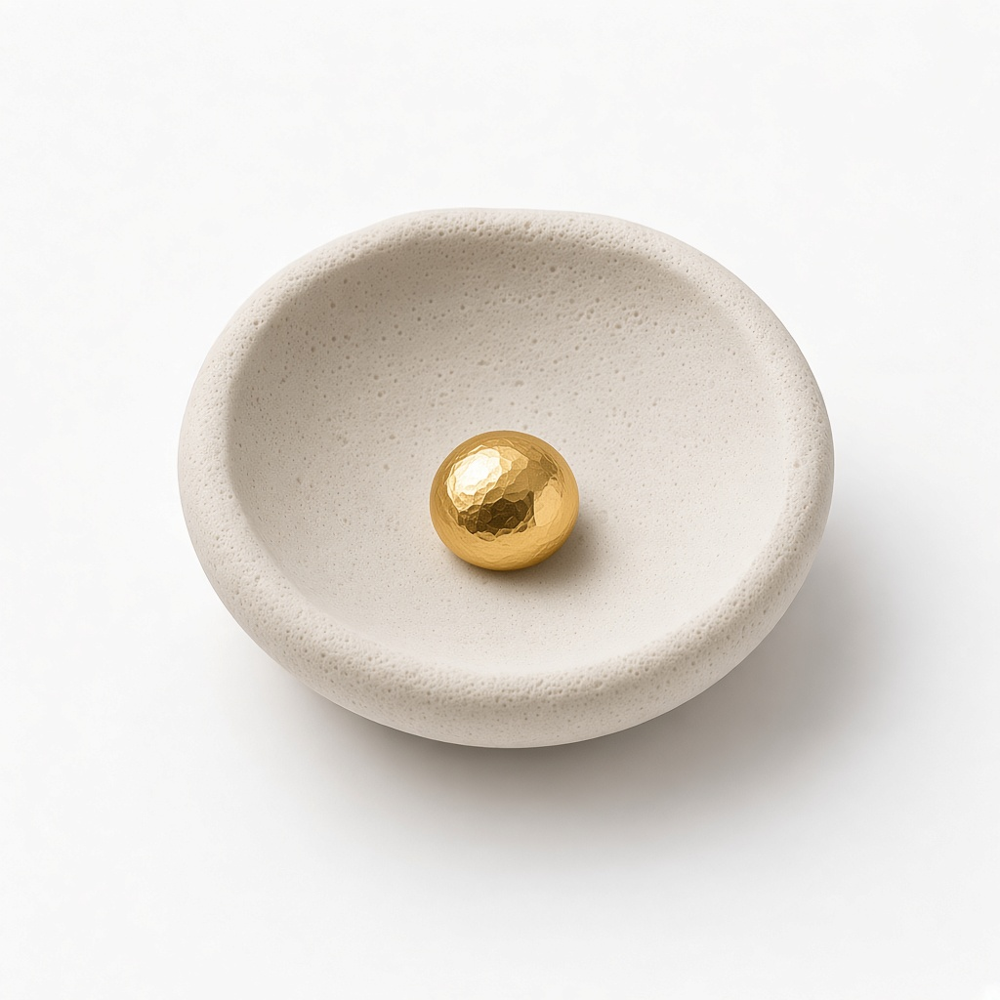

<p align="center">
  
</p>

# CraftAssay

An installable review skill for AI agents.

An assay tests what something is made of, and how good it is.
CraftAssay does that for a tool, a site, or a page. It writes
findings and scores that can be compared across revisions.

The report is an assessment, not a certification.

**Get started:** pick the agent, install the skill, then run the
HarborNote page. Instructions are at
[craftassay.dev/docs/install](https://craftassay.dev/docs/install).

- [Cursor](https://craftassay.dev/docs/install#cursor)
- [Claude Code](https://craftassay.dev/docs/install#claude-code)

**Site:** [craftassay.dev](https://craftassay.dev)

## First run

Save this page as `harbor-note.md`, then ask:

> Use CraftAssay on `harbor-note.md`. Follow the installed CraftAssay
> skill. Write the report. Leave the page unchanged.

```markdown
# HarborNote

Nothing leaves your machine. Ever.

HarborNote is the notes app for people who are tired of clouds.
Install it, type, and you are done. Every device stays in sync
automatically.
```

The run lands in `harbor-note.craftassay/<YYYY-MM-DD>/` with
`report.md`, `scorecard.md`, `findings.md`, and `coverage.md`. The
scorecard rates seven dimensions from 1 to 10, where higher is
better. NR means not rated, because the evidence was too thin to
score. The page should be unchanged. The report should name the sync-vs-privacy
tension without inventing a cloud architecture.

A writable workspace is required. The package does not run an
automatic scanner. The reviewing agent may inspect project files you
point it at. v1 has no CLI.

## Other installation methods

npm supplies the skill files. It does not register the skill with the
agent.

```bash
pnpm add -D craftassay
```

Copy `node_modules/craftassay/skills/craftassay/` into the same
destination the [Get started](https://craftassay.dev/docs/install)
page names for your agent.

Updating the npm dependency does not refresh a folder you already
copied. Copy again after you bump the package.

## CraftAssay and Cold-eye

[Cold-eye](https://coldeye.dev) reviews readiness for a claimed
first-use path. CraftAssay reviews usefulness, clarity, quality, and
presentation, including first-use friction that affects those
scores. It does not issue a release-readiness verdict.
[Smell Check](https://smellcheck.dev) reviews unearned language.
[Detangler](https://detangler.dev) reviews what editing tangled.

## Development

```bash
pnpm install
pnpm test
pnpm site:dev
```

Site (FilePress + docs mount): `pnpm ship`.
npm: `pnpm publish` (you). There is no `publish` script. `prepublishOnly` runs the tests first.
Agents must not run `npm publish`.

## License

MIT. Copyright Catalyst Forge LLC.
